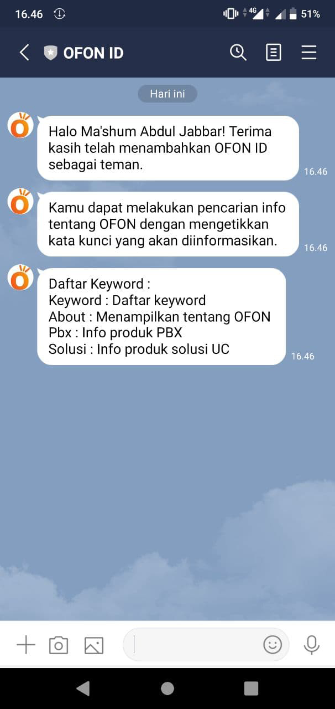
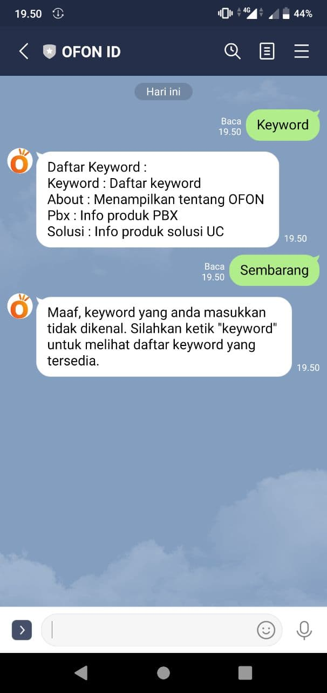
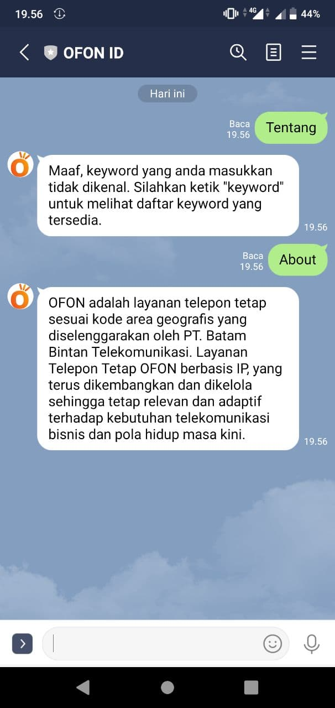
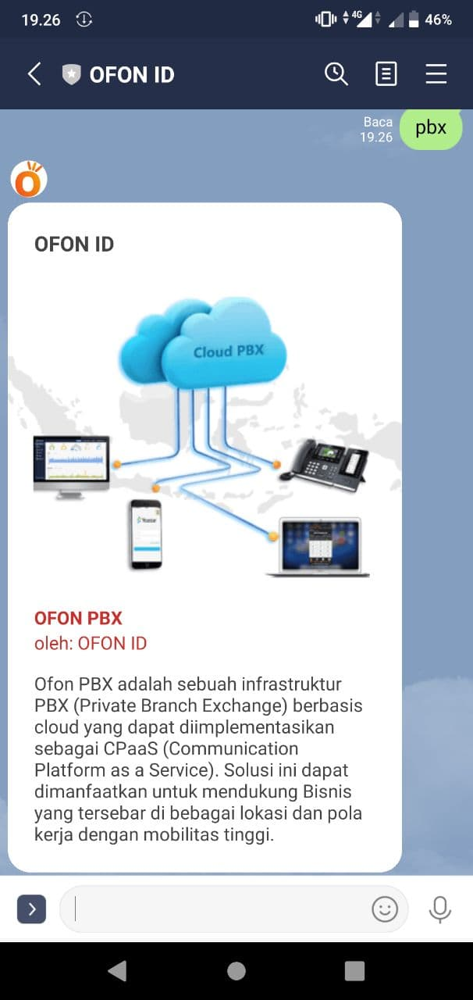
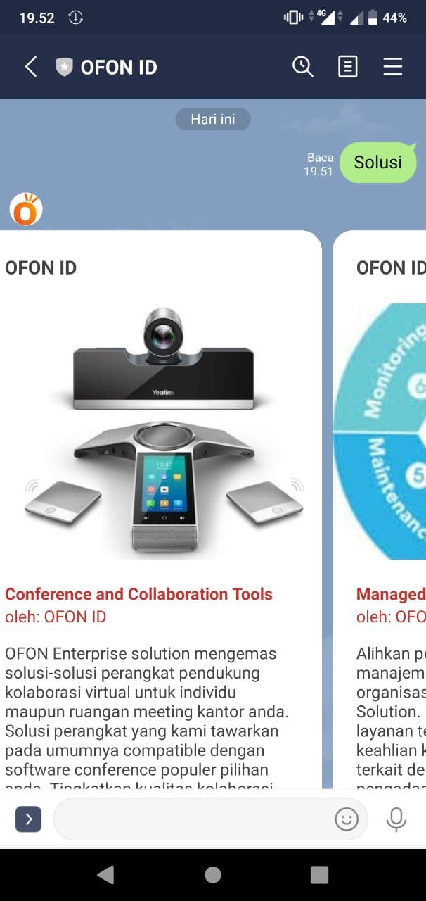
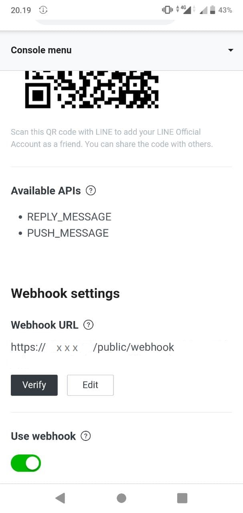

## line-chatbot
LINE Messaging API Chatbot - Submission Dicoding

### Penggunaan
* Untuk penggunaan chatbot pastikan variabel channel_secret dan channel_access_token sudah terisi, sesuai LINE masing-masing.
* Dengan menggunakan PHP Composer, update package Vendor (composer.json) di Server tempat aplikasi chatbot dipasang dengan command : composer update
* Pada LINE Webhook menyesuaikan dengan nama domain dari aplikasi chatbot, contoh : https://xxx/public/webhook dan dapat dikonfigurasi di bagian Messaging API settings serta jangan lupa untuk enable "Use Webhook".

### Screenshoot

